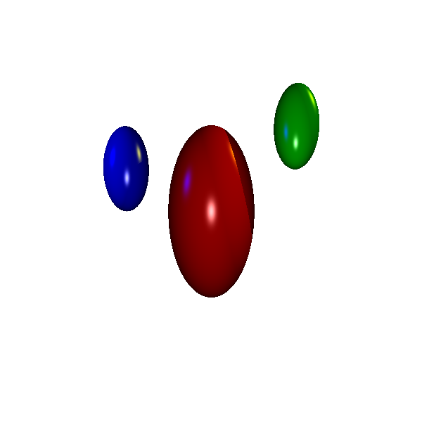
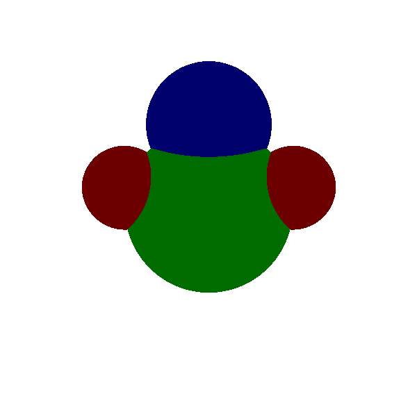
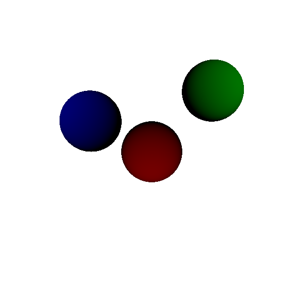
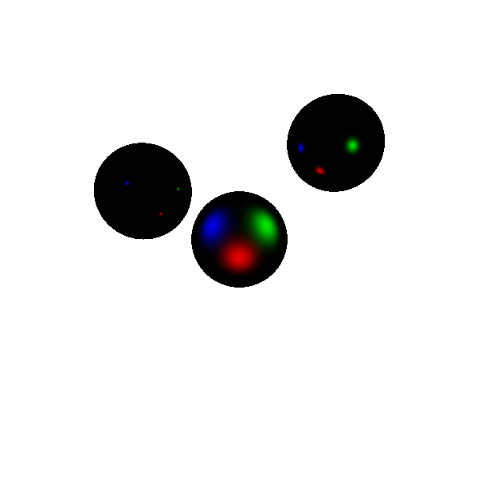

<a name="readme-top"></a>

<!-- PROJECT SHIELDS -->
[![Contributors][contributors-shield]][contributors-url]
[![Forks][forks-shield]][forks-url]
[![Stargazers][stars-shield]][stars-url]
[![Issues][issues-shield]][issues-url]
[![LinkedIn][linkedin-shield]][linkedin-url]

<!-- PROJECT LOGO -->
<br />
<p align="center">
  <a href="https://github.com/cindyunrau/offline-raytracer">
    
  </a>
</p>
<h3 align="center">Offline Raytracer</h3>
<p align="center">
Graphics software used to create highly realistic images by simulating the way light interacts with objects. It traces the path of light rays as they bounce off surfaces, calculating effects like shadows, reflections, and refractions. This process is computationally intensive and usually done offline, meaning it's not performed in real-time but pre-rendered. 
<br />
<br />
<a href="https://github.com/cindyunrau/offline-raytracer">View Demo</a>
·
<a href="https://github.com/cindyunrau/offline-raytracer/issues">Report Bug</a>
·
<a href="https://github.com/cindyunrau/offline-raytracer/issues">Request Feature</a>
</p>

<!-- TABLE OF CONTENTS -->
<details>
  <summary>Table of Contents</summary>
  <ol>
    <li>
      <a href="#about-the-project">About The Project</a>
      <ul>
        <li><a href="#built-with">Built With</a></li>
      </ul>
    </li>
    <li>
      <a href="#getting-started">Getting Started</a>
      <ul>
        <li><a href="#prerequisites">Prerequisites</a></li>
        <li><a href="#installation">Installation</a></li>
      </ul>
    </li>
    <li><a href="#usage">Usage</a></li>
    <li><a href="#roadmap">Roadmap</a></li>
    <li><a href="#contributing">Contributing</a></li>
    <li><a href="#license">License</a></li>
    <li><a href="#contact">Contact</a></li>
    <li><a href="#acknowledgments">Acknowledgments</a></li>
  </ol>
</details>

<!-- ABOUT THE PROJECT -->
## About The Project

Sample Generated Image:  
<p align="center">
    
</p>

Generates .ppm file based on a .txt input file which contains the locations and colours of various spheres and lights. 
<br />
<br />
<br />
Input file should have the following format:

    NEAR [near plane]  
    LEFT [left plane]  
    RIGHT [right plane]  
    BOTTOM [bottom plane]  
    TOP [top plane]  
    RES [number of columns] [number of rows]  
    SPHERE [name] [pos x] [pos y] [pos z] [scale x] [scale y] [scale z] [r] [g] [b] [Ka] [Kd] [Ks] [Kr] [n]  
    ... // up to 14 additional sphere specifications  
    LIGHT [name] [pos x] [pos y] [pos z] [r] [g] [b]  
    ... // up to 9 additional light specifications  
    BACK [r] [g] [b]  
    AMBIENT [r] [g] [b]  
    OUTPUT [output file name]


### Built With

* [![C][C]][C-url]

<p align="right">(<a href="#readme-top">back to top</a>)</p>


<!-- GETTING STARTED -->
## Getting Started

To compile:   
```gcc raytracer.c utilities.c vec.c -o raytracer```  

To run:  
```raytracer [filename]```

<p align="right">(<a href="#readme-top">back to top</a>)</p>

<!-- USAGE EXAMPLES -->
## Usage

Object Intersection Example:  
<p align="center">
    
</p>

Shadow Example:  
<p align="center">
    
</p>

Diffuse Lighting Example:  
<p align="center">
    
</p>

Reflection Example:  
<p align="center">
    
</p>

Illumination Example:  
<p align="center">
    
</p>

Specular Lighting Example:  
<p align="center">
    
</p>


<p align="right">(<a href="#readme-top">back to top</a>)</p>

 
<!-- MARKDOWN LINKS & IMAGES -->
[contributors-shield]: https://img.shields.io/github/contributors/cindyunrau/offline-raytracer.svg?style=for-the-badge
[contributors-url]: https://github.com/cindyunrau/offline-raytracer/graphs/contributors
[forks-shield]: https://img.shields.io/github/forks/cindyunrau/offline-raytracer.svg?style=for-the-badge
[forks-url]: https://github.com/cindyunrau/offline-raytracer/network/members
[stars-shield]: https://img.shields.io/github/stars/cindyunrau/offline-raytracer.svg?style=for-the-badge
[stars-url]: https://github.com/cindyunrau/offline-raytracer/stargazers
[issues-shield]: https://img.shields.io/github/issues/cindyunrau/offline-raytracer.svg?style=for-the-badge
[issues-url]: https://github.com/cindyunrau/offline-raytracer/issues
[linkedin-shield]: https://img.shields.io/badge/-LinkedIn-black.svg?style=for-the-badge&logo=linkedin&colorB=555
[linkedin-url]: https://linkedin.com/in/cindyunrau

[product-screenshot]: images/sample.png
[example-reflection]: images/reflection.png
[example-specular]: images/specular.png

[C]:  	https://img.shields.io/badge/C-00599C?style=for-the-badge&logo=c&logoColor=white
[C-url]: https://www.gnu.org/software/gnu-c-manual/gnu-c-manual.html

